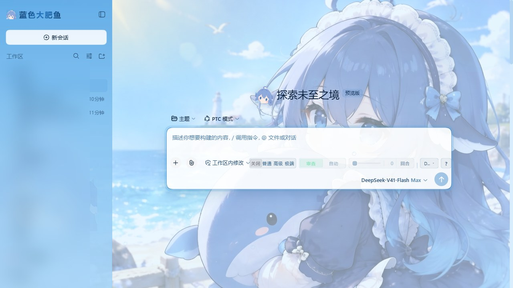
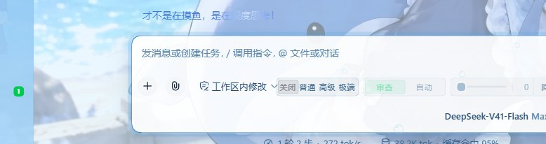
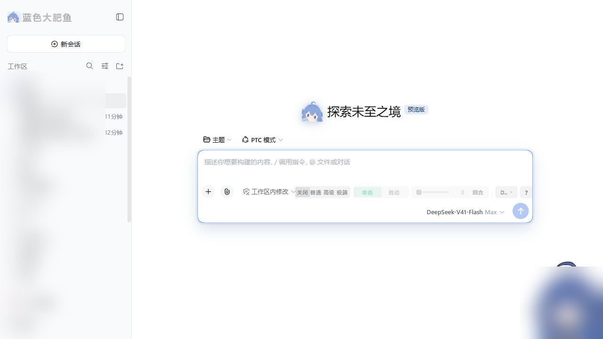

# 蓝色大肥鱼 · DSH 深海皮肤

> DeepSeek Harness Web 界面的一整套深海皮肤：**主题令牌层 + 背景两层 + 侧栏大字标开关 + 运行状态文案轮播**。
> 它是一个**常驻客户端插件**（不是动态插件）：刷新页面、重启 DSH 之后皮肤都还在。



---

## 装

```bash
# 方式一：直接从 GitHub 装（推荐）
dsh plugin --profile web add github:qaz040619/dsh-bluefatfish

# 方式二：下载 Release 里的 tgz 再装
dsh plugin --profile web add "/你的路径/dsh-blue-fat-fish-1.0.0.tgz"
```

装完 **重启 DSH**。左上角会出现鲸鱼娘贴纸 + 渐变「蓝色大肥鱼」大字标，背景换成海面。
卸载：`dsh plugin --profile web remove dsh-blue-fat-fish`，再重启。

profile 名按你自己的填（多数人是 `web`）；`dsh plugin` 只是个 pnpm 转发器，它会自己把本包加进
`dsh.profile.bundles`，不需要手改配置。

## 它做了什么

| 层 | 做法 |
| --- | --- |
| **色彩** | `theme.overrideTokens` 压一层 80 条 `--dsw-*` 令牌，明暗各一套（「晴海白昼」/「深海夜」） |
| **背景** | `body::before` 铺图（带饱和度/对比增益），`body::after` 压一层海水纱；浓度由 `--bff-vis` 控制 |
| **侧栏** | `--dsw-specific-sidebar-fill` 喂渐变（一整块有颜色的面板，不是半透明糊一层）+ 中下部鲸鱼娘水印 |
| **入口** | 左上角大字标占 `sidebar.brand.name` 座位，**同时就是皮肤总开关** |
| **氛围** | `shell.overlay` 里一层气泡 + 鲸影（`aria-hidden`，纯装饰） |
| **组件** | 按钮、输入框、卡片边框、代码块、引用、滚动条、选中色、气泡、toast、tooltip、三态提示 |
| **状态文案** | 一轮对话运行时那行「深度求索中...」换成本包的 10 条台词，每 6 秒轮播一条 |

图标全部是手写 SVG（`React.createElement` 逐个拼），没有任何图标库、没有 emoji。

## 开关

点左上角「蓝色大肥鱼」即可开关：

- **关掉**：只有背景那两层撤走（靠 `--bff-on` 归零），组件样式保留 —— 所以关掉之后不会出现没样式的裸按钮；
- 开关状态是页面内的，**刷新即回到开启**（皮肤默认开）。

## 运行中的状态文案

一轮对话进行中，输入框上方那行状态文案会被替换并轮播：



产品那句话取自 `chat` 命名空间的 `chat.deepDiving` 键。**思考那一行的标题（`message.think`，默认「思考」）不动**，
保持产品原样。

实现走的是官方口子 `locale.addLanguage`：注册一门回退中文的新语言（`zh-whale`「鲸鱼语 · 蓝色大肥鱼」），
在它下面**只写 `chat.deepDiving` 一个键**，其余文案沿回退链落到中文 —— 所以它只动那一行，坏不了别的。
（`locale.register` 的键是**字面字符串**、不加命名空间前缀，所以「注册到 `chat` 命名空间 + 键写 `chat.deepDiving`」才对得上。）

皮肤关闭或插件停止时自动切回你原来的语言；你自己手动换了语言，它不会再抢回来。

## 关掉皮肤的样子



## 改样式

改 `theme/` 与 `src/` 下的源码，然后：

```bash
node build.mjs          # 把源码 + 图 + CSS 打成 lib/client.js
node build.mjs --check  # 只看产物是不是旧的（比对源指纹）
node test/smoke.mjs     # 冒烟测试（28 项，不用浏览器）
```

**改完不用重启也不用刷新**：DSH 自带的 client HMR 每 500 ms 轮询一次 bundle，发现 `lib/client.js` 变了
就把新版换进浏览器（约半秒生效）。

| 想改什么 | 动哪 |
| --- | --- |
| 配色、边框、背景两层、组件样式 | `theme/skin.css` |
| 明暗两套颜色令牌 | `theme/theme.json` |
| 状态文案与轮播间隔 | `src/client-body.js` 顶部 `DIVE_LINES` / `DIVE_INTERVAL_MS` |
| 图标、气泡、鲸影、开关行为 | `src/client-body.js` |

`build.mjs` 会把源文件的 sha256 前 16 位写进产物头部，随时能看出产物是不是旧的。
它同时支持两种目录布局：仓库布局（`theme/` 在包内）与开发布局（主题文件在上一级 `src/`）。

## 目录

```
package.json          包清单：dsh.bundle.patch + dsh.client + exports["./client"]
cordis.patch.yml      bundle 层：把本包那一行插进 profile 组合
lib/index.js          宿主半侧（只负责"占一行"，让 client-modules 扫到 dsh.client）
lib/client.js         浏览器半侧 —— **构建产物，必须提交**（见下）
src/client-body.js    浏览器半侧源码
theme/                皮肤源码：skin.css + theme.json
assets/               背景图与两张贴纸
build.mjs             构建脚本（素材内联进 bundle）
test/smoke.mjs        冒烟测试
tools/                辅助脚本（截图打码）
```

## 为什么 `lib/client.js` 必须提交进仓库

DSH 的浏览器插件走三段链路：`dsh.profile.bundles` 里的一行 → 该包 `dsh.bundle.patch` 声明的 patch 层
把行插进组合 → `client-modules` 扫描这行、读包里的 `dsh.client` 声明，把 `exports["./client"]` 那份
bundle 发给浏览器。

而 pnpm 安装 git 依赖时**不会跑构建脚本**（pnpm ≥10 默认拦 `prepare`），所以仓库里没有构建产物就装不起来。
`lib/client.js` 因此是**提交进仓库的产物**，本仓库的 `.gitattributes` 也把它标成二进制，保证跨平台 clone 后字节不变。

bundle 用的是客户端模块系统的 lazy-CJS 格式（不是 ESM）：

```js
window.__ModuleLoader__.load({
  id: 'dsh-blue-fat-fish',            // 必须等于包名
  factory: (require) => { /* 模块体在浏览器首次需要时才跑 */ },
})
```

能 `require` 的只有外壳播种的冻结模块表：`react` · `react/jsx-runtime` · `react-dom` · `react-dom/client` ·
`@deepseek-ai/cordis` · `@deepseek-ai/dsh-client-store` · `@deepseek-ai/dsh-client-ui-slots` ·
`@deepseek-ai/dsh-client-ui-primitives` · `@deepseek-ai/dsh-client-ui-dockkit`。
本皮肤只用 `react`，不声明任何 `dsh.client.external`。

## 兼容性

在 **dsh 0.1.5-rc.2**（`web` profile）上实测通过。皮肤依赖四样随 DSH 版本走的东西：

- 客户端基座模块表（`react`）；
- 四个 slot 座位：`sidebar.brand.mark`、`sidebar.brand.name`、`shell.overlay`、`conversation.hero.brand.mark`；
- `chat` 命名空间的 `chat.deepDiving` 文案键；
- `theme.overrideTokens`。

版本差太远可能部分失效（最坏情况：背景与配色还在，大字标或状态文案没了）。

**给其它插件作者的两个坑**（都是移植时踩出来的）：

1. `sidebar.brand.mark` / `sidebar.brand.name` 是 **single 槽**：同一个优先级只允许一个登记，
   撞了直接抛 `single slot "…" already has a registration at priority 0`，而且**渲染优先级最低的那个**。
   产品自带的 `dsh-client-ui-brand-official` 登记在 0，所以想盖住它必须显式写 `priority: -1`
   （动态插件不用管，动态运行时会自动分配更低的优先级；常驻包没有这层代劳）。
2. 大字标那个开关必须用**原生捕获阶段监听**（`node.addEventListener('click', fn, true)`）：
   整行是产品的一个 `<button>`（无障碍名「新建会话」），React `onClick` 拦不住它。
   另外别把「点一下之后会话被切走」当成这个 bug —— DSH 自己在页面加载后几秒就会恢复上一个会话，
   验证穿透要看事件有没有冒泡到根容器，不是看会话变没变。

## 素材与许可

- 三张图（背景 / 贴纸 / 头部特写）由本仓库作者提供，一并放在 `assets/`；贴纸是从纯白底原图抠出来的
  （从画面四边洪水填充，只抠"与外部连通的白"，避免掏空发箍内部高光）。
- `docs/screenshots/` 里的效果图已把侧栏会话列表、右下角挂件区域打码（脚本见 `tools/make-screenshots.py`）。
- 本仓库**未附许可证文件**：默认保留所有权利。若需 MIT / Apache-2.0 等授权，请先与作者确认。

## English

A deep-sea skin for the DeepSeek Harness Web GUI: an 80-token theme layer (light/dark), a two-layer
background, a gradient sidebar with a whale sticker, and a rotating status line. It is a regular
**resident client plugin** — it survives page refreshes and DSH restarts.

```bash
dsh plugin --profile web add github:qaz040619/dsh-bluefatfish
# then restart DSH
```

Click the 「蓝色大肥鱼」wordmark at the top of the sidebar to toggle the skin. Built and tested against
**dsh 0.1.5-rc.2**. No license file is included (all rights reserved) — ask the author before reuse.
